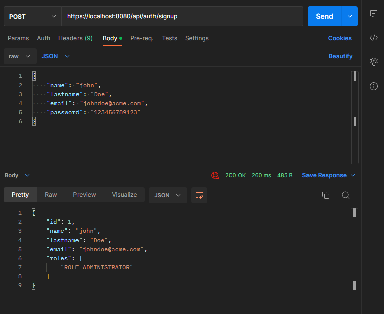
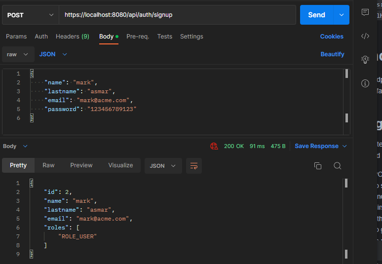
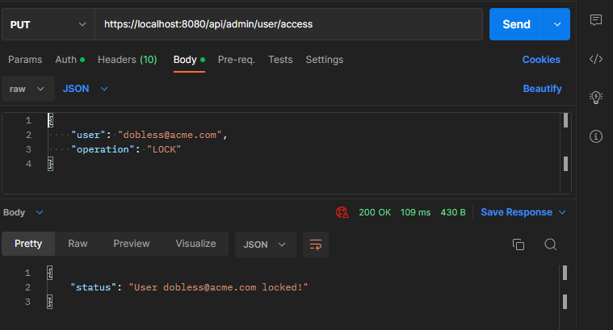
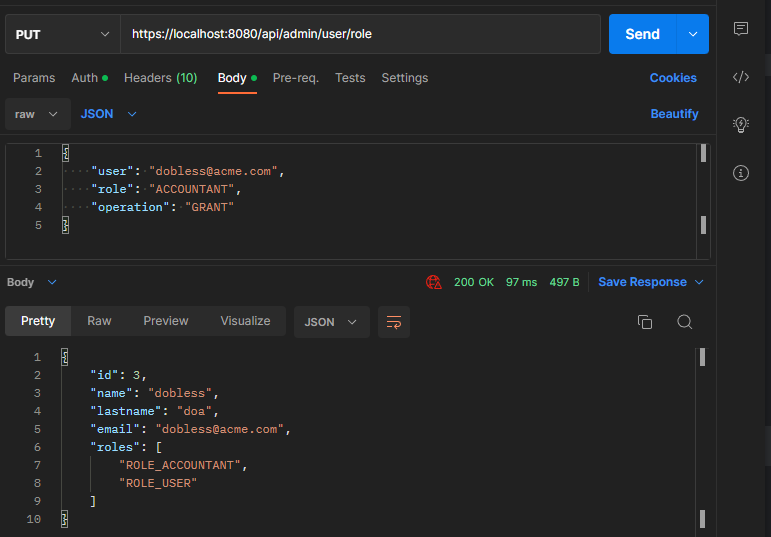
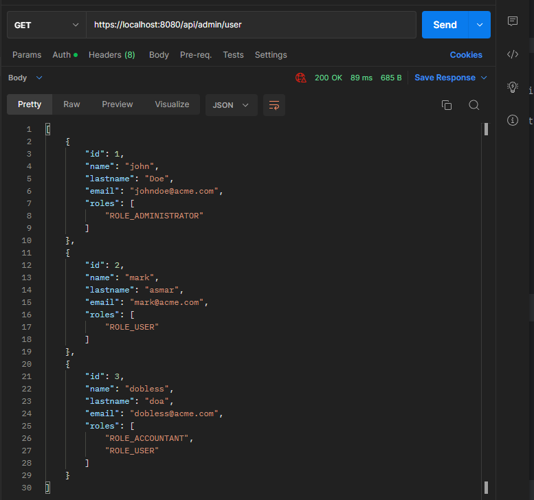
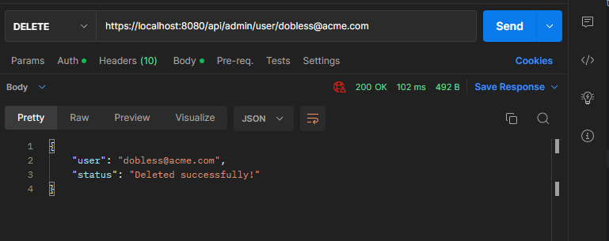
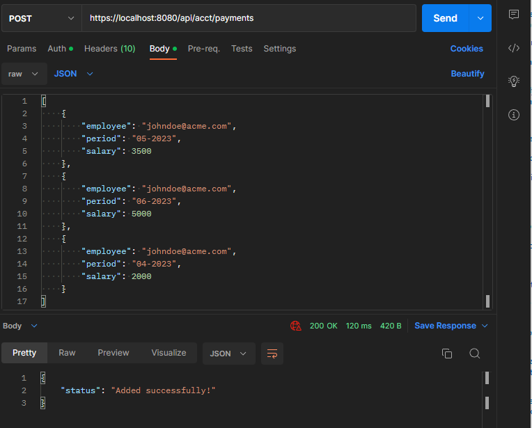
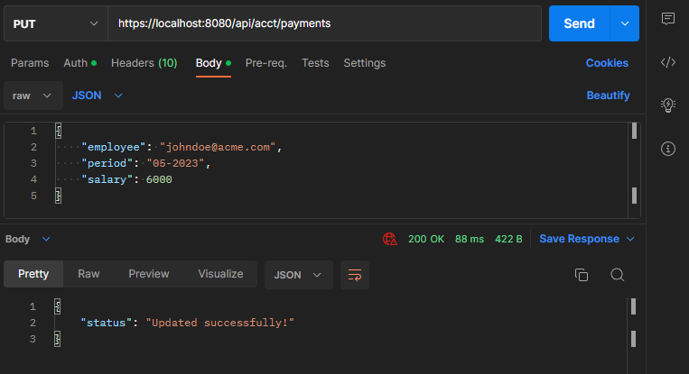

# Account Service
Account service platform using REST API and Spring Security to store, manage payments for an accounting service.
Service uses HTTPS Protocol and self-signed cert, use HTTPS to access the endpoints of the project.

This server uses HTTPS Protocol and Self Signed Cert, Make sure to send all your requests via HTTPS for it to work. You will be able to provide your own properly signed Certificate if you wish, Self Signed Was used for testing purposes and to make it easier to pass around.
The `service.p12` Self Signed Cert is provided with the project, feel free to create your own and put them in `resources/application.properties`

The service uses database a newly one is created in root directory `service.mv.db` to store user data, with secured hashed passwords, stroke each user roles and log all the events that is happening on the server.

# Roles 
- Admin role will be able to view, modify roles, modify access to other users locking their accounts and unlocking them.
- Accountant will be able to process payments to users
- User role will be able to log in, register and check payments received

All roles will be able to change passwords of their account. Upon creation, the first user registered will be granted the Admin role by default, and the Admin will grand newly registered accounts the Accountant role.

# Requirement
- Java version 17+ <a href="https://www.oracle.com/de/java/technologies/downloads/">Java download Link</a>

# Build - Run Project
- Clone repository and navigate into repo's directory
- Run project with `$ ./gradlew bootRun`
 
# Shutdown Server
Actuator is enabled by default, and you will be able to shut down by sending POST request to endpoint `https://localhost:8080/actuator/shutdown`
`localhost:8080` is the default port

# Endpoints
All endpoints will start at port `https://localhost:8080` by default

## Registering
Registering obviously requires no previous role or to be logged in to create a new account
- POST Request to `api/auth/signup` will enable you to send JSON object body of user data with email and password as properties to register as a user.
- First created account will be granted the Admin role, others will be granted User role, the admin will have to give specific users the Accountant Role to be able to process payments, more details in the examples bellow.

### Sign up verification
The sign-up process take data verification into account.
- Email has to end in `@acme.com` to be a valid email
- Password Must be 12 char or longer
- Name and Lastname must be valid and not blank

### Example - First Sign Up

### Example - Second Sign Up

## Admin
Admin will have access to the admin endpoint, where they will be able to grand, modify and adjust other people roles, lock, or unlock their access to the server.
All endpoints that starts with `api/admin/` will require the admin role to be accessed.

- PUT request to `api/admin/user/access` will take a JSON body request with user email as `user` property and `operation` either "LOCK" or "UNLOCK" case must be capital, to modify user's access.
- PUT request to `api/admin/user/role` will take JSON body request with user email as `user` property, `role` with specific role to be granted or removed and `operation` with `GRANT` or `REMOVE` to either grant the role or remove it from user.
Note: Role and operation must be in capital letters.
- GET request to `api/admin/user` will return a response containing a list of all the users
- DELETE request to `api/admin/user/{email}` will take `{email}` as path variable with the user email to be deleted from the server. The Admin role cannot be deleted by other admin roles.

### Example -  Modifying User Access

### Example - Modifying User Role

### Example - Retrieving User Data

### Example - Deleting User

## Accountant
Accountant will have access to the accountant endpoint, where they will be able to add, process and modify other people payment information.
All endpoints that starts with `api/acct/` will require the accountant role to be accessed.

- POST request to `api/acct/payments` will take list of payments for each user. JSON format is user email as `employee` period the time for payment in format of `regex: (0[1-9]|1[0-2])-20\d{2}` and the `salary` that cannot be negative
- PUT request to `api/acct/payment` will take single json object, of specific user to modify payment for in format of user email as `employee`, `period` period of which payment to modify and `payment` the new payment modification

### Example - Create Payments

### Example - Modify Payment

# Credits
All HTTP Requests are made using <a href="http://www.postman.com">Postman</a>